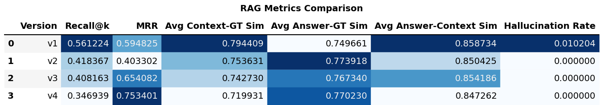

# RAG System Implementation & Retrieval Pipeline Optimization

## Project Overview
This project aims to identify the most efficient and reliable **RAG (Retrieval-Augmented Generation)** configuration for a specific multi-source hybrid dataset. Instead of a static implementation, we explored the technological frontier through four iterative versions, using a custom quantitative scoring evaluation framework.

## Dataset
* **Total Size:** ~420MB hybrid dataset
    * **PubMed:** 400MB of medical abstracts.
    * **Technical Docs:** 20MB from `libc` and `PyTorch` documentation.

## Tech Stack
* **Embedding Model:** `BAAI/bge-small-en-v1.5`
* **LLM:** `Qwen/Qwen2.5-1.5B-Instruct` (4-bit quantization for local inference)
* **Vector Database/Search:** FAISS (IndexFlatL2, HNSW)
* **Retrieval Techniques:** BM25, Hybrid Search, RRF Fusion, Cross-Encoder Re-ranking

## The Evolutionary Path (Four Versions)

| Version | Key Features & Architecture |
| :--- | :--- |
| **v1 (Baseline)** | Basic text chunking; **IndexFlatL2** exhaustive search. |
| **v2 (Advanced)** | Implemented **HNSW** for high-speed indexing; introduced **Hybrid Search** (Dense + BM25); utilized **RRF (Reciprocal Rank Fusion)** and metadata filtering for PubMed. |
| **v3 (Optimal)** | Built upon v2 with a **Cross-Encoder Re-ranker** for top-k refinement. Selected as the **final version** due to stability and speed. |
| **v4 (Experimental)** | Optimized chunking for technical docs and questions texts; applied metadata mapping and context expansion across all sources. |

## Quantitative Evaluation
Due to restricted LLM API access for tools like RAGAS, this project uses a custom suite to quantify performance:

### Core Definitions
* $G$: Ground Truth text
* $A$: Generated Answer text
* $C = \{c_1, c_2, \dots, c_k\}$: Set of top-$k$ retrieved context chunks
* $E(x)$: Embedding vector of text $x$
* $sim(u, v) = \frac{u \cdot v}{\|u\| \|v\|}$: Cosine similarity between two vectors

### Metrics & Formulas

#### 1. Recall@k
Determines if the required information is captured within the top-k retrieved chunks.
Recall@k = 1  if  max_{c in C} [ sim(E(c), E(G)) ] >= τ_recall
           0  otherwise
*(Threshold $\tau_{recall} = 0.75$)*

#### 2. Answer-GT Similarity
Measures the semantic alignment between the LLM response and the reference answer.
Sim(A, G) = sim(E(A), E(G))
          = (E(A) · E(G)) / (||E(A)|| ||E(G)||)

#### 3. Answer-Context Similarity (Grounding)
Ensures the answer is derived from the provided documents.
C_concat = concat(c1, c2, ..., ck)
Sim(A, C) = sim(E(A), E(C_concat))

#### 4. Hallucination Rate
A heuristic flag when the answer lacks similarity to both the ground truth and context.
**Individual Flag ($H_i$):**
Hi = 1  if  Sim(A, G) < τ_h  AND  Sim(A, C) < τ_h
     0  otherwise
**Overall hallucination rate:**
Hallucination Rate = (1 / N) * sum_{i=1..N} Hi

**Overall Rate:**
$$\text{Hallucination Rate} = \frac{1}{N} \sum_{i=1}^{N} H_i$$

## Results & Analysis

The performance of each version was systematically evaluated using the metrics defined above. The following chart provides a comparative analysis of the four iterations:

### Key Observations from Evaluation:

* **Superior Retrieval Precision (MRR):** Version 3 and Version 4 show a significant leap in **MRR (Mean Reciprocal Rank)**, this indicates that the introduction of the **Re-ranker** effectively pushed the most relevant chunks to the top positions.
* **Elimination of Hallucinations:** While the v1 baseline had a hallucination rate of **1.02%**, iterations v2 through v4 achieved a **0.00% hallucination rate**. This proves that the **Hybrid Search** and **Metadata Filtering** implemented since v2 successfully grounded the LLM in the provided context.
* **Semantic Consistency:** All versions maintain a high **Answer-Context Similarity (~0.85)**, which shows that the generated responses are strictly derived from the retrieved documents.
* **Optimization Trade-off:** Although v4 has the highest MRR, **Version 3** was selected as the final architecture because it delivers highly competitive accuracy while maintaining the performance advantages of the **HNSW index** without the additional complexity of the v4 experimental chunking.

## Final Implementation: Version 3

Based on the quantitative benchmarking results, **Version 3** has been selected as the definitive implementation for this project. The complete Python source code for this optimized pipeline can be found in the `src/` directory.

### Key Components in `src/`:
* **Hybrid Retriever:** Combines `BAAI/bge-small-en-v1.5` dense embeddings with BM25 keyword search.
* **Re-ranking Engine:** Implements a Cross-Encoder to refine the top-k candidates.
* **Metadata Processor:** Handles specialized mapping for PubMed and technical documentation to enhance grounding.

## RAG Output Showcase (Sample from v3)

Below are live examples of the **Version 3** pipeline processing a complex query. This snapshot demonstrates how the system retrieves context, generates an answer, and compares it against the ground truth.

### Example 1: Technical Documentation (Libc)

> **Question:** "Why was the fcntl64() system call specifically added in Linux 2.4?"
>
> **Generated Answer:**
> The original Linux fcntl() system call was not designed to handle large file offsets. Consequently, fcntl64() was added in Linux 2.4 to address this limitation by employing a different structure (flock64) for file locking. For applications using glibc, these details are handled transparently by the wrapper function.
>
> **Retrieved Contexts (Top 3 Chunks):**
> 1. `...The original Linux fcntl() system call was not designed to handle large file offsets... fcntl64() system call was added in Linux 2.4...`
> 2. `...The newer system call employs a different structure for file locking, flock64, and corresponding operations, F_GETLK64...`
> 3. `...However, these details can be ignored by applications using glibc, whose fcntl() wrapper function transparently employs the more recent system call...`
>
> **Ground Truth:**  "It was added because the original fcntl() call could not handle large file offsets in the flock structure."

### Example 2: Technical Documentation (PyTorch)
This example highlights the system's ability to retrieve precise technical implementation details from the PyTorch documentation.

> **Question:** "What is the primary use case for register_forward_hook in PyTorch?"
>
> **Generated Answer:** The `register_forward_hook` method allows users to install a hook called during the forward pass of a module. It is primarily used for adding logic or modifying data flow, such as **logging intermediate results, applying transformations to inputs, or tracking statistics**. It enables customization of the standard forward pass without altering the original source code.
>
> **Retrieved Contexts:**
> * **Chunk 1:** "...Forward hooks are called during the forward pass. They can be installed for a given module with `register_forward_hook`... these hooks can be used to execute arbitrary code or modify inputs/outputs without having to change the module's `forward()` function."
> * **Chunk 2:** "...Some useful examples for this functionality include debugging, visualizing activations, examining gradients in-depth, etc. Hooks can be added to modules you haven't written yourself..."
>
> **Ground Truth:** "It is used to capture or modify the input/output of a specific layer during the forward pass without altering the model's original source code (common for feature extraction)."

### Example 3: Medical Literature (PubMed)
This example demonstrates the system's ability to synthesize information from multi-center clinical trial abstracts and provide accurate medical outcome summaries.

> **Question:** "How did physician-assessed nasal signs and symptoms change at study endpoint?"
>
> **Generated Answer:**
> Based on the retrieved information (PubMed abstract 17304887), ciclesonide therapy significantly reduced both **morning/evening reflective** and **instantaneous total nasal symptom scores (TNSS)** compared with the placebo. At the study endpoint, a greater decrease from baseline was observed in physician-assessed overall nasal signs and symptoms severity for the ciclesonide group ($P = 0.051$).
>
> **Retrieved Contexts:**
> * **Source 1 (PubMed 17304887):** "At the end point, a greater decrease from baseline was observed in physician-assessed overall nasal signs and symptoms severity for the ciclesonide group compared with the placebo group (P = .051)."
> * **Source 2 (PubMed 17304887):** "Ciclesonide therapy significantly reduced average morning and evening reflective TNSSs... and instantaneous TNSSs (P = .001) over 6 weeks of treatment."
>
> **Ground Truth:**  "At the end point, a greater decrease from baseline was observed in physician-assessed overall nasal signs and symptoms severity for the ciclesonide group compared with the placebo group (P = .051)."
>
